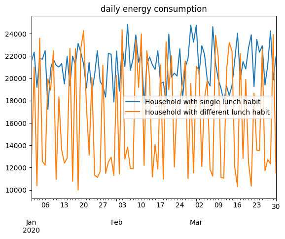

Cooking Appliances
==================

In this example, appliances with multiple preferences index and
attributes are modelled.

To have a better understanding of RAMP features for modelling this
category of appliances, two households are considered:

1. A household with a fixed lunch habit of eating soup every day.
2. A household with two lunch preferences: cooking soup or rice.

The number of user preferences can be specified through
**“user_preference”** parameter when initializing a **User** instance.

.. code:: ipython3

    # importing functions
    from ramp import User, UseCase, get_day_type
    import pandas as pd

Creating a user category
~~~~~~~~~~~~~~~~~~~~~~~~

.. code:: ipython3

    user_1 = User(
        user_name="Household with single lunch habit",
        num_users=1,
        user_preference=1,  # user_1 has only one lunch preference
    )
    
    user_2 = User(
        user_name="Household with different lunch habits",
        num_users=1,
        user_preference=2,  # user_2 has two lunch preferences
    )

Defining the cycles for cooking soup and rice
~~~~~~~~~~~~~~~~~~~~~~~~~~~~~~~~~~~~~~~~~~~~~

For cooking soup it is assumed that the user needs 25 minutes divided
into two parts:

============= ===== ====
cycle         power time
============= ===== ====
Boiling Water 1200  5
Cooking soup  750   20
============= ===== ====

For cooking rice it is assumed that the user needs 15 minutes divided
into two parts:

============= ===== ====
cycle         power time
============= ===== ====
Boiling Water 1200  5
Cooking rice  600   10
============= ===== ====

.. code:: ipython3

    # soup for lunch
    soup_1 = user_1.add_appliance(
        name="soup for lunch",
        power=1200,
        func_time=25,
        func_cycle=25,
        thermal_p_var=0.2,
        fixed_cycle=1,
        window_1=[12 * 60, 15 * 60],
        p_11=1200,  # power of the first cycle
        t_11=5,  # time needed for the first cycle
        p_12=750,  # power of the second cycle
        t_12=20,  # time needed for the second cycle
        cw11=[12 * 60, 15 * 60],
    )

The second user has two different preferences for lunch. Accordingly, we
need to model these preferences and their characteristics as two
different appliances.

Each preference needs to be specified with its associated cooking energy
needs, such as the power, functioning time and the duty cycles of the
cooking process.

More importantly, for each preference, the user needs to specify the
index of preference by using the **pref_index** parameter. In this
example, soup is the first preference of the user (pref_index = 1), and
rice is the second one (pref_index = 2).

.. code:: ipython3

    # soup for lunch
    soup_2 = user_2.add_appliance(
        name="soup for lunch",
        power=1200,
        func_time=25,
        func_cycle=25,
        thermal_p_var=0.2,
        fixed_cycle=1,
        pref_index=1,  # the first preference
        window_1=[12 * 60, 15 * 60],
        p_11=1200,  # power of the first cycle
        t_11=5,  # time needed for the first cycle
        p_12=750,  # power of the second cycle
        t_12=20,  # time needed for the second cycle
        cw11=[12 * 60, 15 * 60],
    )

.. code:: ipython3

    # rice for lunch
    rice_2 = user_2.add_appliance(
        name="rice for lunch",
        power=1200,
        func_time=15,
        func_cycle=15,
        thermal_p_var=0.2,
        pref_index=2,  # the second preference
        fixed_cycle=1,
        window_1=[12 * 60, 15 * 60],
        p_11=1200,  # power of the first cycle
        t_11=5,  # time needed for the first cycle
        p_12=600,  # power of the second cycle
        t_12=10,  # time needed for the second cycle
        cw11=[12 * 60, 15 * 60],
    )

.. code:: ipython3

    # you can have an overview of data inputs by usering User.export_to_dataframe method
    user_lunch = UseCase(users=[user_1, user_2], date_start="2020-01-01")
    user_lunch.export_to_dataframe().T

.. raw:: html

    

    
    <table border="1" class="dataframe">
      <thead>
        <tr style="text-align: right;">
          <th></th>
          <th>0</th>
          <th>1</th>
          <th>2</th>
        </tr>
      </thead>
      <tbody>
        <tr>
          <th>user_name</th>
          <td>Household with single lunch habit</td>
          <td>Household with different lunch habit</td>
          <td>Household with different lunch habit</td>
        </tr>
        <tr>
          <th>num_users</th>
          <td>1</td>
          <td>1</td>
          <td>1</td>
        </tr>
        <tr>
          <th>user_preference</th>
          <td>1</td>
          <td>2</td>
          <td>2</td>
        </tr>
        <tr>
          <th>name</th>
          <td>soup for lunch</td>
          <td>soup for lunch</td>
          <td>rice for lunch</td>
        </tr>
        <tr>
          <th>number</th>
          <td>1</td>
          <td>1</td>
          <td>1</td>
        </tr>
        <tr>
          <th>power</th>
          <td>1200.0</td>
          <td>1200.0</td>
          <td>1200.0</td>
        </tr>
        <tr>
          <th>num_windows</th>
          <td>1</td>
          <td>1</td>
          <td>1</td>
        </tr>
        <tr>
          <th>func_time</th>
          <td>25</td>
          <td>25</td>
          <td>15</td>
        </tr>
        <tr>
          <th>time_fraction_random_variability</th>
          <td>0</td>
          <td>0</td>
          <td>0</td>
        </tr>
        <tr>
          <th>func_cycle</th>
          <td>25</td>
          <td>25</td>
          <td>15</td>
        </tr>
        <tr>
          <th>fixed</th>
          <td>no</td>
          <td>no</td>
          <td>no</td>
        </tr>
        <tr>
          <th>fixed_cycle</th>
          <td>1</td>
          <td>1</td>
          <td>1</td>
        </tr>
        <tr>
          <th>occasional_use</th>
          <td>1</td>
          <td>1</td>
          <td>1</td>
        </tr>
        <tr>
          <th>flat</th>
          <td>no</td>
          <td>no</td>
          <td>no</td>
        </tr>
        <tr>
          <th>thermal_p_var</th>
          <td>0.2</td>
          <td>0.2</td>
          <td>0.2</td>
        </tr>
        <tr>
          <th>pref_index</th>
          <td>0</td>
          <td>1</td>
          <td>2</td>
        </tr>
        <tr>
          <th>wd_we_type</th>
          <td>2</td>
          <td>2</td>
          <td>2</td>
        </tr>
        <tr>
          <th>p_11</th>
          <td>1200</td>
          <td>1200</td>
          <td>1200</td>
        </tr>
        <tr>
          <th>t_11</th>
          <td>5</td>
          <td>5</td>
          <td>5</td>
        </tr>
        <tr>
          <th>cw11_start</th>
          <td>720</td>
          <td>720</td>
          <td>720</td>
        </tr>
        <tr>
          <th>cw11_end</th>
          <td>900</td>
          <td>900</td>
          <td>900</td>
        </tr>
        <tr>
          <th>p_12</th>
          <td>750</td>
          <td>750</td>
          <td>600</td>
        </tr>
        <tr>
          <th>t_12</th>
          <td>20</td>
          <td>20</td>
          <td>10</td>
        </tr>
        <tr>
          <th>cw12_start</th>
          <td>0</td>
          <td>0</td>
          <td>0</td>
        </tr>
        <tr>
          <th>cw12_end</th>
          <td>0</td>
          <td>0</td>
          <td>0</td>
        </tr>
        <tr>
          <th>r_c1</th>
          <td>0</td>
          <td>0</td>
          <td>0</td>
        </tr>
        <tr>
          <th>p_21</th>
          <td>0</td>
          <td>0</td>
          <td>0</td>
        </tr>
        <tr>
          <th>t_21</th>
          <td>0</td>
          <td>0</td>
          <td>0</td>
        </tr>
        <tr>
          <th>cw21_start</th>
          <td>0</td>
          <td>0</td>
          <td>0</td>
        </tr>
        <tr>
          <th>cw21_end</th>
          <td>0</td>
          <td>0</td>
          <td>0</td>
        </tr>
        <tr>
          <th>p_22</th>
          <td>0</td>
          <td>0</td>
          <td>0</td>
        </tr>
        <tr>
          <th>t_22</th>
          <td>0</td>
          <td>0</td>
          <td>0</td>
        </tr>
        <tr>
          <th>cw22_start</th>
          <td>0</td>
          <td>0</td>
          <td>0</td>
        </tr>
        <tr>
          <th>cw22_end</th>
          <td>0</td>
          <td>0</td>
          <td>0</td>
        </tr>
        <tr>
          <th>r_c2</th>
          <td>0</td>
          <td>0</td>
          <td>0</td>
        </tr>
        <tr>
          <th>p_31</th>
          <td>0</td>
          <td>0</td>
          <td>0</td>
        </tr>
        <tr>
          <th>t_31</th>
          <td>0</td>
          <td>0</td>
          <td>0</td>
        </tr>
        <tr>
          <th>cw31_start</th>
          <td>0</td>
          <td>0</td>
          <td>0</td>
        </tr>
        <tr>
          <th>cw31_end</th>
          <td>0</td>
          <td>0</td>
          <td>0</td>
        </tr>
        <tr>
          <th>p_32</th>
          <td>0</td>
          <td>0</td>
          <td>0</td>
        </tr>
        <tr>
          <th>t_32</th>
          <td>0</td>
          <td>0</td>
          <td>0</td>
        </tr>
        <tr>
          <th>cw32_start</th>
          <td>0</td>
          <td>0</td>
          <td>0</td>
        </tr>
        <tr>
          <th>cw32_end</th>
          <td>0</td>
          <td>0</td>
          <td>0</td>
        </tr>
        <tr>
          <th>r_c3</th>
          <td>0</td>
          <td>0</td>
          <td>0</td>
        </tr>
        <tr>
          <th>window_1_start</th>
          <td>720</td>
          <td>720</td>
          <td>720</td>
        </tr>
        <tr>
          <th>window_1_end</th>
          <td>900</td>
          <td>900</td>
          <td>900</td>
        </tr>
        <tr>
          <th>window_2_start</th>
          <td>0</td>
          <td>0</td>
          <td>0</td>
        </tr>
        <tr>
          <th>window_2_end</th>
          <td>0</td>
          <td>0</td>
          <td>0</td>
        </tr>
        <tr>
          <th>window_3_start</th>
          <td>0</td>
          <td>0</td>
          <td>0</td>
        </tr>
        <tr>
          <th>window_3_end</th>
          <td>0</td>
          <td>0</td>
          <td>0</td>
        </tr>
        <tr>
          <th>random_var_w</th>
          <td>0</td>
          <td>0</td>
          <td>0</td>
        </tr>
      </tbody>
    </table>
    

Generating a profile for some months
~~~~~~~~~~~~~~~~~~~~~~~~~~~~~~~~~~~~

.. code:: ipython3

    # number of days
    n_days = 90
    
    user_lunch.initialize(num_days=n_days)
    # storing all the profiles for all the users
    profiles = pd.DataFrame(
        index=pd.date_range(start="2020-01-01", periods=1440 * n_days, freq="T")
    )
    
    # here we need to use the
    
    for user in user_lunch.users:
        # storing daily profiles for a user
        user_profiles = []
        for day_idx, day in enumerate(user_lunch.days):
            single_profile = user.generate_single_load_profile(
                prof_i=day_idx,  # the day to generate the profile
                day_type=get_day_type(day),
            )
    
            user_profiles.extend(single_profile)
    
        profiles[user.user_name] = user_profiles

.. parsed-literal::

    You will simulate 90 day(s) from 2020-01-01 00:00:00 until 2020-03-31 00:00:00

Considering that the second user has the possibility of cooking rice for
lunch, which has a less energy-intensive cooking cycle, we expect to see
a higher energy consumption for the user that only eats soup, in most of
the cases.

.. code:: ipython3

    # daily energy consumption
    profiles.resample("1d").sum().plot(title="daily energy consumption")

.. parsed-literal::

    <Axes: title={'center': 'daily energy consumption'}>

