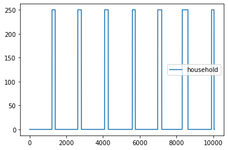

Fixed-Flat Appliance
====================

.. code:: ipython3

    # importing functions
    from ramp import User, UseCase, get_day_type
    import pandas as pd

Creating a user
~~~~~~~~~~~~~~~

.. code:: ipython3

    school = User(user_name="School", num_users=1)

Adding an appliance with flat and fixed consumption
~~~~~~~~~~~~~~~~~~~~~~~~~~~~~~~~~~~~~~~~~~~~~~~~~~~

.. code:: ipython3

    indoor_bulb = school.add_appliance(
        name="Indoor Light Bulb",
        number=10,
        power=25,
        num_windows=1,
        func_time=210,
        time_fraction_random_variability=0.2,
        func_cycle=60,
        fixed="yes", # This means all the 'n' appliances of this kind are always switched-on together
        flat="yes", # This means the appliance is not subject to random variability in terms of total usage time
    )
    indoor_bulb.windows(
        window_1=[1200, 1440],  # from 20:00 to 24:00
        window_2=[0, 0],
        random_var_w=0.35,
    )

Initialize the usecase (it defines the peak time range and simulation time)
~~~~~~~~~~~~~~~~~~~~~~~~~~~~~~~~~~~~~~~~~~~~~~~~~~~~~~~~~~~~~~~~~~~~~~~~~~~

.. code:: ipython3

    school_case = UseCase(users=[school], date_start="2023-01-01")
    school_case.initialize(num_days=7)

.. parsed-literal::

    You will simulate 7 day(s) from 2023-01-01 00:00:00 until 2023-01-08 00:00:00

Generating a profile for the 1st week of the year
~~~~~~~~~~~~~~~~~~~~~~~~~~~~~~~~~~~~~~~~~~~~~~~~~

From the usecase directly

.. code:: ipython3

    first_week = school_case.generate_daily_load_profiles(flat=True)

or from the user

.. code:: ipython3

    first_week = []
    
    for day_idx, day in enumerate(school_case.days):
        first_week.extend(
            school.generate_single_load_profile(
                prof_i=day_idx,  # the day to generate the profile
                peak_time_range=school_case.peak_time_range,
                day_type=get_day_type(day),
            )
        )

.. code:: ipython3

    first_week = pd.DataFrame(first_week, columns=["household"])
    first_week.plot()

.. parsed-literal::

    <Axes: >

