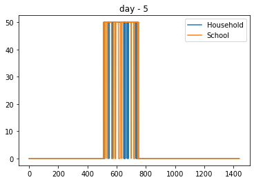
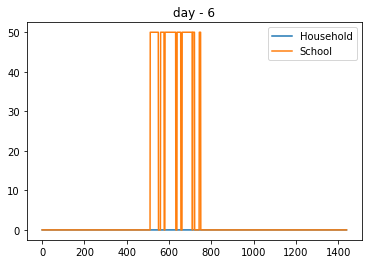
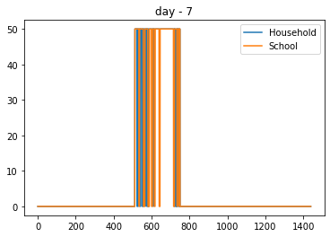

Appliances with occasional use
==============================

There are some appliances that are occasionally included in the mix pf
appliances that the user switches-on during the day. For example, iron,
stereo, printers and …

Within ramp, the user may specify the probability of using an appliance
on the daily mix with a parameter called, **occasional_use**.

When occasional_use = 0, the appliance is always present in the mix and
when occasional_use = 1, the appliance is never present.

The following example, investigates the effect of this parameter by
modelling two user category: \* A household that uses a computer with
ocationally \* A school that uses the computer everyday

.. code:: ipython3

    # importing functions
    from ramp import User,calc_peak_time_range,yearly_pattern
    import pandas as pd

Creating a user category and appliances
~~~~~~~~~~~~~~~~~~~~~~~~~~~~~~~~~~~~~~~

.. code:: ipython3

    household = User("Household")
    school = User("School")

.. code:: ipython3

    computer_0 = household.Appliance(
        name = "Household Computer",
        number = 1,
        power  = 50,
        num_windows = 1,
        func_time = 210,
        occasional_use = 0.5  # 50% chance of occasional use
    )
    
    computer_0.windows(
        window_1 = [510,750],
    )

.. code:: ipython3

    computer_1 = school.Appliance(
        name = "School Computer",
        number = 1,
        power  = 50,
        num_windows = 1,
        func_time = 210,
        time_fraction_random_variability = 0.2,
        func_cycle = 10,
        occasional_use = 1 # always present in the mix of appliances
    )
    
    computer_1.windows(
        window_1 = [510,750],
    )

.. code:: ipython3

    # Checking the maximum profile of the two appliances
    
    max_profile_c1 = pd.DataFrame(computer_0.maximum_profile,columns=[computer_0.name])
    max_profile_c2 = pd.DataFrame(computer_1.maximum_profile,columns=[computer_1.name])
    
    max_profile_c1.plot()
    max_profile_c2.plot()

.. parsed-literal::

    <AxesSubplot:>

.. image:: output_6_1.png

.. image:: output_6_2.png

Generating profiles
~~~~~~~~~~~~~~~~~~~

.. code:: ipython3

    peak_time_range = calc_peak_time_range(
        user_list = [household,school]
    )
    year_behaviour = yearly_pattern()

.. code:: ipython3

    # plotting profiles for 5 days
    days = range(10)
    
    for day in days:
        household_profile = household.generate_single_load_profile(
            prof_i = day, 
            peak_time_range = peak_time_range,
            Year_behaviour = year_behaviour
        )
        
        school_profile = school.generate_single_load_profile(
            prof_i = day, 
            peak_time_range = peak_time_range,
            Year_behaviour = year_behaviour
        )
        
        pd.DataFrame(
            data = [household_profile,school_profile],
            columns = range(1440),
            index = [household.user_name,school.user_name]
        ).T.plot(title=f"day - {day}")
        
        

.. image:: output_9_0.png

.. image:: output_9_1.png

.. image:: output_9_2.png

.. image:: output_9_3.png

.. image:: output_9_4.png

As it can be seen from the figures, the computer is always present in
the school appliance mix while for household, is occasionally present.
