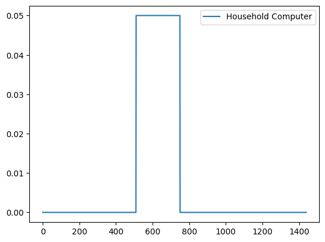
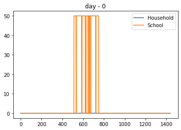
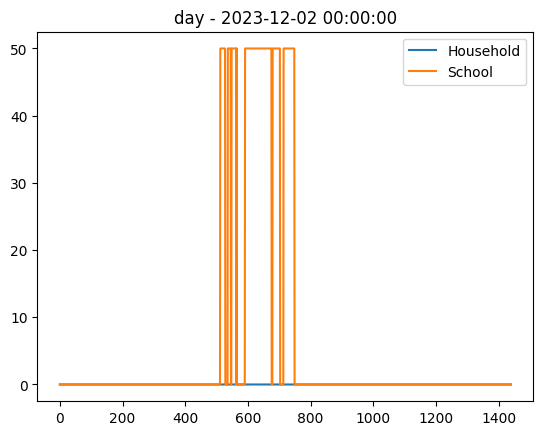
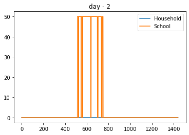
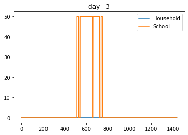
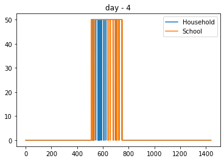

Appliances with occasional use
==============================

There are some appliances that are occasionally included in the mix of
appliances that the user switches on during the day. For example, an
iron, a stereo, printers, etc.

Within RAMP, the user may specify the probability of using an appliance
on the daily mix with a parameter called **occasional_use**.

When ``occasional_use = 0``, the appliance is always present in the mix,
and when ``occasional_use = 1``, the appliance is never present. Any
in-between values will lead to a probabilistic calculation to decide
whether the appliance is used or not on a given day.

The following example investigates the effect of this parameter by
modelling two user categories: \* A household that uses a computer
occasionally \* A school that uses the computer every day

.. code:: ipython3

    # importing functions
    from ramp import User, UseCase, get_day_type
    import pandas as pd

Creating user categories and appliances
~~~~~~~~~~~~~~~~~~~~~~~~~~~~~~~~~~~~~~~

.. code:: ipython3

    household = User("Household")
    school = User("School")

.. code:: ipython3

    computer_0 = household.add_appliance(
        name="Household Computer",
        number=1,
        power=50,
        num_windows=1,
        func_time=210,
        occasional_use=0.5,  # 50% chance of occasional use,
        window_1=[510, 750],
    )

.. code:: ipython3

    computer_1 = school.add_appliance(
        name="School Computer",
        number=1,
        power=50,
        num_windows=1,
        func_time=210,
        time_fraction_random_variability=0.2,
        func_cycle=10,
        occasional_use=1,  # always present in the mix of appliances,
        window_1=[510, 750],
    )

.. code:: ipython3

    # Checking the maximum profile of the two appliances
    
    max_profile_c1 = pd.DataFrame(computer_0.maximum_profile, columns=[computer_0.name])
    max_profile_c2 = pd.DataFrame(computer_1.maximum_profile, columns=[computer_1.name])
    
    max_profile_c1.plot()
    max_profile_c2.plot()

.. parsed-literal::

    <Axes: >

Generating profiles
~~~~~~~~~~~~~~~~~~~

.. code:: ipython3

    use_case = UseCase(users=[household, school])
    use_case.initialize(5)

.. parsed-literal::

    You will simulate 5 day(s) from 2023-12-01 00:00:00 until 2023-12-06 00:00:00

.. code:: ipython3

    for day_idx, day in enumerate(use_case.days):
        household_profile = household.generate_single_load_profile(
            prof_i=day_idx, day_type=get_day_type(day)
        )
    
        school_profile = school.generate_single_load_profile(
            prof_i=day_idx, day_type=get_day_type(day)
        )
    
        pd.DataFrame(
            data=[household_profile, school_profile],
            columns=range(1440),
            index=[household.user_name, school.user_name],
        ).T.plot(title=f"day - {day}")

As it can be seen from the figures, the computer is always present in
the school’s appliance mix while, for the household, it is only
occasionally present.
