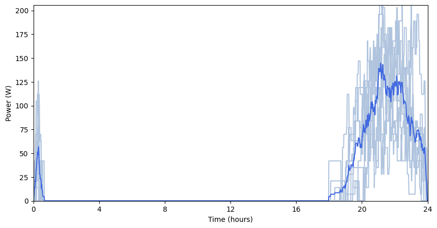
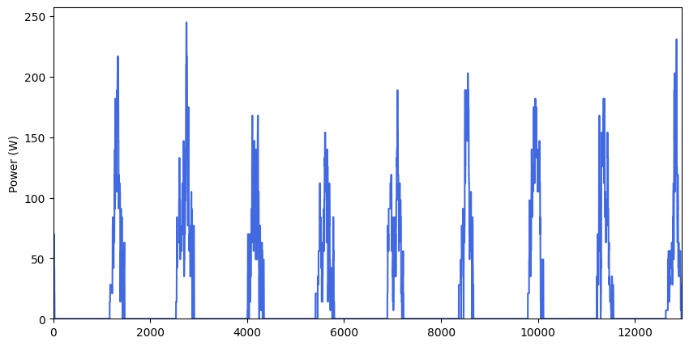
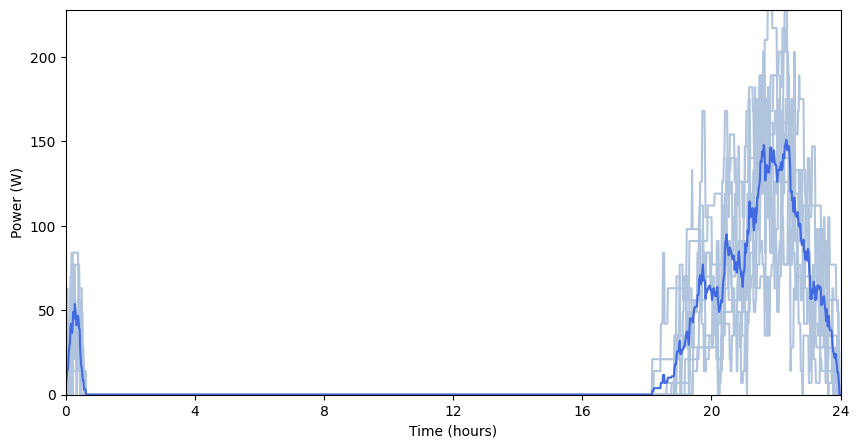
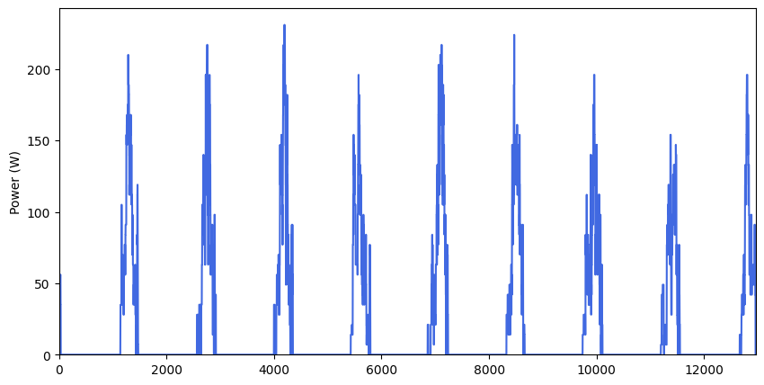
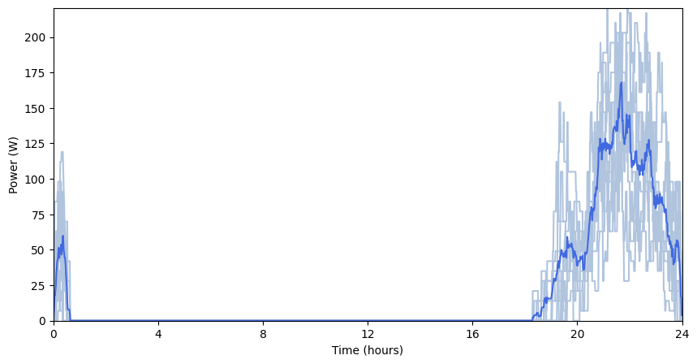

Parallel processing
===================

There is the possibility of generating UseCase profiles using parallel
processing.

For example, to generate 365 profiles using a parallel process in shell,
use the ``-p`` option.

ramp -i <path to your input file> -p -n 365

The following cells provide you with a way to use the parallel process
in a pure python code.

.. code:: ipython3

    from ramp import UseCase
    
    import numpy as np
    import random
    import math
    import pandas as pd
    from ramp.core.utils import calc_time_taken, get_day_type
    from ramp import User, UseCase
    from ramp.post_process import post_process as pp
    
    
    use_case = UseCase(date_start="2022-01-01", date_end="2022-01-09", peak_enlarge=0.15)
    household = User(
        user_name="Household",
        num_users=10,
    )
    indoor_bulb = household.add_appliance(
        name="Indoor Light Bulb",
        number=6,
        power=7,
        num_windows=2,
        func_time=120,
        time_fraction_random_variability=0.2,
        func_cycle=10,
        window_1=[1170, 1440],  # from 19:30 to 24:00
        window_2=[0, 30],  # from 24 to 00:30
        random_var_w=0.35,
    )
    
    use_case.add_user(household)

.. parsed-literal::

    You will simulate 9 day(s) from 2022-01-01 00:00:00 until 2022-01-10 00:00:00

Run UseCase without parallel processing
---------------------------------------

.. code:: ipython3

    daily_profiles = use_case.generate_daily_load_profiles(flat=False, verbose=True)
    
    # Post-processes the results and generates plots
    Profiles_avg, Profiles_list_kW, Profiles_series = pp.Profile_formatting(daily_profiles)
    pp.Profile_series_plot(Profiles_series)  # by default, profiles are plotted as a series
    
    if (
        len(daily_profiles) > 1
    ):  # if more than one daily profile is generated, also cloud plots are shown
        pp.Profile_cloud_plot(daily_profiles, Profiles_avg)

.. parsed-literal::

    Day 1 / 9 completed
    Day 2 / 9 completed
    Day 3 / 9 completed
    Day 4 / 9 completed
    Day 5 / 9 completed
    Day 6 / 9 completed
    Day 7 / 9 completed
    Day 8 / 9 completed
    Day 9 / 9 completed

.. image:: output_6_1.png

Run UseCase with parallel processing
------------------------------------

Explicitly calling the parallel method

.. code:: ipython3

    Profiles_list = use_case.generate_daily_load_profiles_parallel(flat=False)
    
    # Post-processes the results and generates plots
    Profiles_avg, Profiles_list_kW, Profiles_series = pp.Profile_formatting(Profiles_list)
    pp.Profile_series_plot(Profiles_series)  # by default, profiles are plotted as a series
    
    if (
        len(Profiles_list) > 1
    ):  # if more than one daily profile is generated, also cloud plots are shown
        pp.Profile_cloud_plot(Profiles_list, Profiles_avg)

.. parsed-literal::

    Computing appliances profiles: 100%|████████| 90/90 [00:00<00:00, 1284.63unit/s]

You can also set the ``parallel_processing`` attribute of the
``UseCase`` instance to ``True`` and use the
``generate_daily_load_profiles``

.. code:: ipython3

    use_case.parallel_processing = True
    
    Profiles_list = use_case.generate_daily_load_profiles(flat=False)
    
    # Post-processes the results and generates plots
    Profiles_avg, Profiles_list_kW, Profiles_series = pp.Profile_formatting(Profiles_list)
    pp.Profile_series_plot(Profiles_series)  # by default, profiles are plotted as a series
    
    if (
        len(Profiles_list) > 1
    ):  # if more than one daily profile is generated, also cloud plots are shown
        pp.Profile_cloud_plot(Profiles_list, Profiles_avg)

.. parsed-literal::

    Computing appliances profiles: 100%|████████| 90/90 [00:00<00:00, 1437.07unit/s]

:download:`Link to the jupyter notebook file </../notebooks/parallel_processing.ipynb>`.
