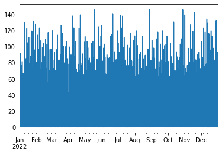
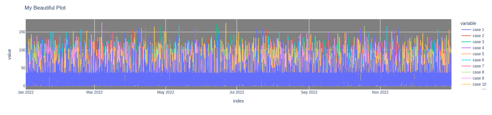
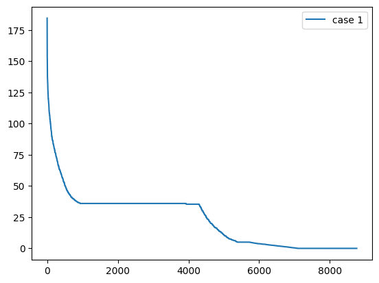
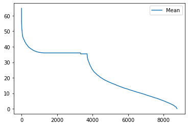
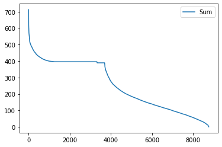
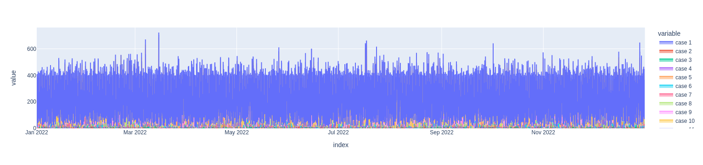
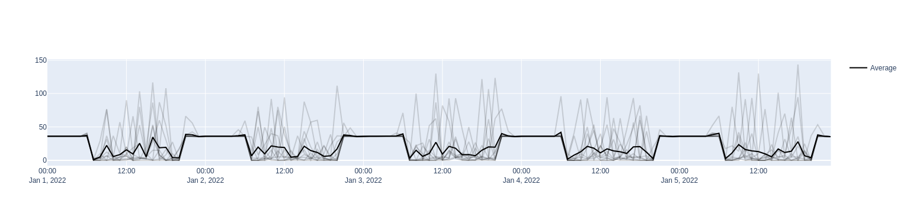

Plotting functionalities
========================

RAMP’s plotting class offers some functionalities for visualizing
outputs. A ``Plot`` class can be initialized by reading a
``pandas.DataFrame`` or reading results from a ``.csv`` or ``.xlsx``
file.

Initializing a Plot class
-------------------------

Running RAMP interactively
~~~~~~~~~~~~~~~~~~~~~~~~~~

.. code:: ipython3

    from ramp import User, UseCase

.. code:: ipython3

    # creating a user and adding some appliances
    
    Petrol_Station = User(
        user_name="Petrol Station",
        num_users=1,
    )
    
    # add appliances
    outside_bulb = Petrol_Station.add_appliance(
        name="Security Light",
        number=2,
        power=18,  # watt
        num_windows=2,  # security light has two functioning window: during night and during day
        fixed_cycle=0,  # bulb has no duty cycle and always work with a single cycle
        window_1=[0, 7 * 60],  # from mid-night to 7 AM with opening
        window_2=[21 * 60, 23 * 60 + 59],  # from 21 to 23:59
        fixed="yes",
        flat="yes",
    )
    
    
    inside_bulb = Petrol_Station.add_appliance(
        name="Indoor Light",
        number=1,
        power=75,  # watt
        num_windows=1,  # security light has two functioning window: during night and during day
        fixed_cycle=0,  # bulb has no duty cycle and always work with a single cycle
        window_1=[7 * 60, 21 * 60],  # from mid-night to 7 AM,9PM with opening,
        func_cycle=1,  # when the appliance is switched on, it remains on at least for a min,
        occasional_use=1,  # it is always present in the energy mix
        func_time=30,  # usually is used around 60 min during the whole day
        time_fraction_random_variability=0.9,
        random_var_w=0.15,
    )
    
    petrol_pump = Petrol_Station.add_appliance(
        name="Petrol Pump",
        number=1,
        power=200,
        num_windows=1,
        fixed_cycle=0,
        window_1=[7 * 60, 21 * 60],
        func_cycle=1,
        occasional_use=1,
        func_time=40,
        time_fraction_random_variability=0.15,
        random_var_w=0.15,
    )
    
    # phone chargers
    phone_charger = Petrol_Station.add_appliance(
        name="Phone Charger",
        number=1,
        power=5,
        num_windows=1,
        fixed_cycle=0,
        window_1=[7 * 60, 21 * 60],
        func_cycle=30,
        occasional_use=0.7,
        func_time=60,
        time_fraction_random_variability=0.15,
        random_var_w=0.15,
    )
    
    # Radio
    radio = Petrol_Station.add_appliance(
        name="Radio",
        number=1,
        power=5,
        num_windows=1,
        fixed_cycle=0,
        window_1=[7 * 60, 21 * 60],
        func_cycle=20,
        occasional_use=0.95,
        func_time=4 * 60,
        time_fraction_random_variability=0.15,
        random_var_w=0.15,
    )

.. code:: ipython3

    # running the simulation for multiple cases to generate mutlipe simulations for a year = 2022
    
    number_of_simulations = 11
    number_of_days = 365
    
    uc = UseCase(users=[Petrol_Station], date_start="2022-01-01")
    uc.initialize(num_days=number_of_days)
    
    plot = uc.generate_daily_load_profiles(
        cases=[profile for profile in range(1, number_of_simulations + 1)]
    )

.. parsed-literal::

    You will simulate 365 day(s) from 2022-01-01 00:00:00 until 2023-01-01 00:00:00

If the dataframe object did not have a ``pd.DatatimeIndex``, the plot
class could not be initialized. in this case, you can use the ``index``
argument to pass a datetime index!

Running via the CLI and reading back the outputs from ``.csv`` or ``.xlsx``
~~~~~~~~~~~~~~~~~~~~~~~~~~~~~~~~~~~~~~~~~~~~~~~~~~~~~~~~~~~~~~~~~~~~~~~~~~~

If you run your RAMP simulations from a terminal, and save your outputs
into a file, you can read your saved results to perform your analysis.
The structure of the saved results should be exactly as shown in
previous line where the index is a date-time index and on the columns
you have different cases, or even different users of your simulation
case. To read the file:

.. code:: ipython3

    # Uncomment the line below once you have replaced the placeholder with the path of an existing file
    # plot = Plot.from_file(file="path to .csv or .xlsx file")

If the data in the file did not have a date-time index, the plot class
could not be initialized! in this case, you can use the ``index``
argument to pass a datetime index!

Filtering data using loc & iloc functions
-----------------------------------------

If you need to use only a part of your data, you can use the ``loc``
function. For example, to take only the second day of your data:

.. code:: ipython3

    import pandas as pd
    
    second_day = pd.date_range(
        start="2022-01-01 00:00:00", freq="1min", periods=24 * 60  # a full day
    )
    
    filtered_data = plot.loc(index=second_day)

If you need to also filter on the columns, you can use the columns
argument or use the ``get item`` method:

.. code:: ipython3

    # using the function
    filtered_data = plot.loc(index=second_day, columns=["case 1", "case 2"])
    filtered_data

.. parsed-literal::

                         case 1  case 2
    2022-01-01 00:00:00    36.0    36.0
    2022-01-01 00:01:00    36.0    36.0
    2022-01-01 00:02:00    36.0    36.0
    2022-01-01 00:03:00    36.0    36.0
    2022-01-01 00:04:00    36.0    36.0
    2022-01-01 00:05:00    36.0    36.0
    2022-01-01 00:06:00    36.0    36.0
    2022-01-01 00:07:00    36.0    36.0
    2022-01-01 00:08:00    36.0    36.0
    2022-01-01 00:09:00    36.0    36.0
     ......

.. code:: ipython3

    # using the get item method
    filtered_column = plot["case 1"]
    filtered_column

.. parsed-literal::

                         case 1
    2022-01-01 00:00:00    36.0
    2022-01-01 00:01:00    36.0
    2022-01-01 00:02:00    36.0
    2022-01-01 00:03:00    36.0
    2022-01-01 00:04:00    36.0
    2022-01-01 00:05:00    36.0
    2022-01-01 00:06:00    36.0
    2022-01-01 00:07:00    36.0
    2022-01-01 00:08:00    36.0
    2022-01-01 00:09:00    36.0
     ......

To filter the data using the position of the data, you can use the
``iloc`` function. For example, for filtering your data from the 6th row
to 10th row:

.. code:: ipython3

    filtered_rows = plot.iloc(index=slice(6, 11))
    filtered_rows

.. parsed-literal::

                         case 1  case 2  case 3  case 4  case 5  case 6  case 7  case 8  case 9  case 10  case 11
    2022-01-01 00:06:00    36.0    36.0    36.0    36.0    36.0    36.0    36.0    36.0    36.0     36.0     36.0
    2022-01-01 00:07:00    36.0    36.0    36.0    36.0    36.0    36.0    36.0    36.0    36.0     36.0     36.0
    2022-01-01 00:08:00    36.0    36.0    36.0    36.0    36.0    36.0    36.0    36.0    36.0     36.0     36.0
    2022-01-01 00:09:00    36.0    36.0    36.0    36.0    36.0    36.0    36.0    36.0    36.0     36.0     36.0
    2022-01-01 00:10:00    36.0    36.0    36.0    36.0    36.0    36.0    36.0    36.0    36.0     36.0     36.0
     ......

Adding new columns to the data
------------------------------

In case you want to add new columns to your data, you can use the
``add_column`` function:

.. code:: ipython3

    # lets take a copy of the current plot object
    
    copy_plot = plot.copy()
    
    # lets take a column of the existing data
    new_data = plot["case 1"]
    
    # lets change the name of the column assuming that this is a new data
    new_data.columns = ["new column"]
    
    copy_plot.add_column(new_data)
    
    copy_plot

.. parsed-literal::

                         case 1  case 2  case 3  case 4  case 5  case 6  case 7  case 8  case 9  case 10  case 11  new column
    2022-01-01 00:00:00    36.0    36.0    36.0    36.0    36.0    36.0    36.0    36.0    36.0     36.0     36.0        36.0
    2022-01-01 00:01:00    36.0    36.0    36.0    36.0    36.0    36.0    36.0    36.0    36.0     36.0     36.0        36.0
    2022-01-01 00:02:00    36.0    36.0    36.0    36.0    36.0    36.0    36.0    36.0    36.0     36.0     36.0        36.0
    2022-01-01 00:03:00    36.0    36.0    36.0    36.0    36.0    36.0    36.0    36.0    36.0     36.0     36.0        36.0
    2022-01-01 00:04:00    36.0    36.0    36.0    36.0    36.0    36.0    36.0    36.0    36.0     36.0     36.0        36.0
    2022-01-01 00:05:00    36.0    36.0    36.0    36.0    36.0    36.0    36.0    36.0    36.0     36.0     36.0        36.0
    2022-01-01 00:06:00    36.0    36.0    36.0    36.0    36.0    36.0    36.0    36.0    36.0     36.0     36.0        36.0
    2022-01-01 00:07:00    36.0    36.0    36.0    36.0    36.0    36.0    36.0    36.0    36.0     36.0     36.0        36.0
    2022-01-01 00:08:00    36.0    36.0    36.0    36.0    36.0    36.0    36.0    36.0    36.0     36.0     36.0        36.0
    2022-01-01 00:09:00    36.0    36.0    36.0    36.0    36.0    36.0    36.0    36.0    36.0     36.0     36.0        36.0
     ......

Resampling data
---------------

If you want to represent your data in a different time resolution, you
need to resample the data. In this case, the original data (plot object)
has a minute time resolution:

.. code:: ipython3

    plot.freq

.. parsed-literal::

    <Minute>

Let’s assume you want to resample your data to an hourly resolution. To
do so, you can use the ``resample`` function:

.. code:: ipython3

    hourly_data = plot.resample(
        freq="1h",  # resampling freqency, similar pd.DataFrame rule
        rule="sum",  # different options for resampling data like sum, mean, nearest
        conversion=60,  # resampling data from minute resolution to hour resolution has an assumption of dividing the minute date by 60 minutes to sum to hourly data
    )

Let’s check the resolution now:

.. code:: ipython3

    hourly_data.freq

.. parsed-literal::

    <Hour>

You can further apply all the ``Plot`` functions to the output of this
resampling. For example, if you want to calculate the weekly consumption
average based on the hourly data, you can use:

.. code:: ipython3

    weekly = hourly_data.resample(freq="1w", rule="mean")

.. code:: ipython3

    weekly.freq

.. parsed-literal::

    <Week: weekday=6>

Compute Mean, Sum, and Peak
---------------------------

You can calculate the mean and the sum of all the columns of your RAMP
simulations stored in a ``Plot`` object using the ``mean`` and ``sum``
functions:

.. code:: ipython3

    mean = hourly_data.mean()
    mean

.. parsed-literal::

                              Mean
    2022-01-01 00:00:00  36.000000
    2022-01-01 01:00:00  36.000000
    2022-01-01 02:00:00  36.000000
    2022-01-01 03:00:00  36.000000
    2022-01-01 04:00:00  36.000008
    2022-01-01 05:00:00  36.053523
    2022-01-01 06:00:00  37.023682
    2022-01-01 07:00:00   2.744088
    2022-01-01 08:00:00   9.889124
    2022-01-01 09:00:00  14.973023
     ......

.. code:: ipython3

    summed = hourly_data.sum()
    summed

.. parsed-literal::

                                Sum
    2022-01-01 00:00:00  396.000000
    2022-01-01 01:00:00  396.000000
    2022-01-01 02:00:00  396.000000
    2022-01-01 03:00:00  396.000000
    2022-01-01 04:00:00  396.000083
    2022-01-01 05:00:00  396.588750
    2022-01-01 06:00:00  407.260500
    2022-01-01 07:00:00   30.184967
    2022-01-01 08:00:00  108.780367
    2022-01-01 09:00:00  164.703250
     ......

You can also find the the peak values and correspondoing hours to the
peak value for each column of your data using the ``peak`` property:

.. code:: ipython3

    peak = hourly_data.peak

.. code:: ipython3

    peak

.. parsed-literal::

    {'case 1': 2022-10-28 06:00:00    146.00145
     Freq: H, Name: case 1, dtype: float64,
     'case 2': 2022-01-28 10:00:00    149.585283
     Freq: H, Name: case 2, dtype: float64,
     'case 3': 2022-08-26 21:00:00    164.669633
     Freq: H, Name: case 3, dtype: float64,
     'case 4': 2022-07-29 21:00:00    172.667983
     Freq: H, Name: case 4, dtype: float64,
     'case 5': 2022-07-04 06:00:00    166.000917
     Freq: H, Name: case 5, dtype: float64,
     'case 6': 2022-05-14 06:00:00    162.667917
     Freq: H, Name: case 6, dtype: float64,
     'case 7': 2022-03-13 06:00:00    151.002083
     Freq: H, Name: case 7, dtype: float64,
     'case 8': 2022-12-16 05:00:00    169.334517
     Freq: H, Name: case 8, dtype: float64,
     'case 9': 2022-06-15 18:00:00    149.836033
     Freq: H, Name: case 9, dtype: float64,
     'case 10': 2022-02-15 06:00:00    187.00175
     Freq: H, Name: case 10, dtype: float64,
     'case 11': 2022-10-21 06:00:00    166.00235
     Freq: H, Name: case 11, dtype: float64}

Visualisation
-------------

A ``Plot`` object offers some easy-to-use plotting functions for routine
visualisations. Each plotting function allows you to choose the plotting
engine, which can be either ``matplotlib`` or ``plotly``. The output of
the plot functions will be a ``matplotlib`` or ``plotly`` object, so you
can customize your functions after plotting with your specific taste and
plotting style! You can also use the ``** kwargs`` to pass ``plotly`` or
``matplotlib`` specific styling features.

Line plot
~~~~~~~~~

With the line plot function, you can choose one or multiple columns of
your data to plot a simple line plot:

.. code:: ipython3

    # plotting one column using matplotlib engine (default engine)
    hourly_data.line(columns="case 1")

.. parsed-literal::

    <AxesSubplot:>

.. code:: ipython3

    # plotting all columns using plotly engine, you can
    hourly_data.line(engine="plotly", plot_bgcolor="gray", title="My Beautiful Plot")

Load duration curve
~~~~~~~~~~~~~~~~~~~

A Load duration curve (LDC), also known as a duration curve or a
load-duration profile, represents the cumulative distribution of a given
energy demand over a specified period of time. To plot this curve, you
may use the ``load_duration_curve`` function in different modes, like
taking a specific column of your data and calculating the mean or sum.
To this end, go through the steps below.

.. code:: ipython3

    # Taking a column
    hourly_data.load_duration_curve(column="case 1")

.. parsed-literal::

    <AxesSubplot:>

.. code:: ipython3

    # plotting for mean
    hourly_data.mean().load_duration_curve("Mean")

.. parsed-literal::

    <AxesSubplot:>

.. code:: ipython3

    # Taking sum
    hourly_data.sum().load_duration_curve("Sum")

.. parsed-literal::

    <AxesSubplot:>

Area Plot
~~~~~~~~~

Using the ``area`` plot function, you can plot the cumulative sum of the
the columns in your data.

.. code:: ipython3

    hourly_data.area(engine="plotly")

Shadow Plot
~~~~~~~~~~~

In case you want to represent all the simulations together to show the
variability of stochastic profiles generated by RAMP, you may use the
shadow plot.

.. code:: ipython3

    # to have a more visible visualisation, let's only take the first 5 days of the data using the iloc function
    
    hourly_data.iloc(index=slice(0, 24 * 5)).shadow(
        average=True,  # plotting the average with a bold line and all the other columns as a cloud around it
        engine="plotly",
    )

General plot function
~~~~~~~~~~~~~~~~~~~~~

The Plot object has a function called ``plot`` that returns a
pd.DataFrame.plot function offering some more plotting routines:

.. code:: ipython3

    # plotting the yearly consumption of different cases as bar charts
    hourly_data.resample("1y", "sum").plot(kind="bar")

.. parsed-literal::

    <AxesSubplot:>

.. image:: output_46_1.png

Saving the data into a file
---------------------------

If you want to save the data into a ``.csv`` or ``.xlsx`` file, you can
use the two save functions:

.. code:: ipython3

    # saving as csv
    hourly_data.to_csv("path and name of csv file.csv")
    
    # saving as xslx
    hourly_data.to_excel("path and name of excel file.xlsx")
