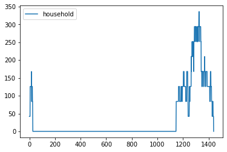

Simple Appliances with multiple functioning time
================================================

.. code:: ipython3

    # importing functions
    from ramp import User,calc_peak_time_range,yearly_pattern
    import pandas as pd

Creating a user category
~~~~~~~~~~~~~~~~~~~~~~~~

.. code:: ipython3

    household = User(
        user_name = "Household",
        num_users = 10,
    )

Creating a simple appliance with two functioning time
~~~~~~~~~~~~~~~~~~~~~~~~~~~~~~~~~~~~~~~~~~~~~~~~~~~~~

.. code:: ipython3

    indoor_bulb = household.Appliance(
        name = "Indoor Light Bulb",
        number = 6,
        power  = 7,
        num_windows = 2,
        func_time = 120,
        time_fraction_random_variability = 0.2,
        func_cycle = 10
    )
    
    indoor_bulb.windows(
        window_1 = [1170,1440], # from 19:30 to 24:00
        window_2 = [0,30], # from 24 to 00:30
        random_var_w = 0.35,
    )

.. code:: ipython3

    # Checking the maximum profile of the appliance and user
    
    max_profile_bulb = pd.DataFrame(indoor_bulb.maximum_profile,columns=["appliance"])
    max_profile_user = pd.DataFrame(household.maximum_profile,columns=["household"])
    
    max_profile_bulb.plot()
    max_profile_user.plot()

.. parsed-literal::

    <AxesSubplot:>

.. image:: output_6_1.png

.. image:: output_6_2.png

Defining the peak time range using the calc_peak_time_range
~~~~~~~~~~~~~~~~~~~~~~~~~~~~~~~~~~~~~~~~~~~~~~~~~~~~~~~~~~~

.. code:: ipython3

    peak_time_range = calc_peak_time_range(
        user_list = [household]
    )
    
    print(peak_time_range)

.. parsed-literal::

    [675 676 677 678 679 680 681 682 683 684 685 686 687 688 689 690 691 692
     693 694 695 696 697 698 699 700 701 702 703 704 705 706 707 708 709 710
     711 712 713 714 715 716 717 718 719 720 721 722 723 724 725 726 727 728
     729 730 731 732 733 734 735 736 737 738 739 740 741 742 743 744 745 746
     747 748]

Defining the yearly patterns
~~~~~~~~~~~~~~~~~~~~~~~~~~~~

by default the yearly_pattern function returns weekdays (defined by 0)
/weekends (defined by 1) division

.. code:: ipython3

    year_behaviour = yearly_pattern()
    
    print(year_behaviour)

.. parsed-literal::

    [0. 0. 0. 0. 0. 1. 1. 0. 0. 0. 0. 0. 1. 1. 0. 0. 0. 0. 0. 1. 1. 0. 0. 0.
     0. 0. 1. 1. 0. 0. 0. 0. 0. 1. 1. 0. 0. 0. 0. 0. 1. 1. 0. 0. 0. 0. 0. 1.
     1. 0. 0. 0. 0. 0. 1. 1. 0. 0. 0. 0. 0. 1. 1. 0. 0. 0. 0. 0. 1. 1. 0. 0.
     0. 0. 0. 1. 1. 0. 0. 0. 0. 0. 1. 1. 0. 0. 0. 0. 0. 1. 1. 0. 0. 0. 0. 0.
     1. 1. 0. 0. 0. 0. 0. 1. 1. 0. 0. 0. 0. 0. 1. 1. 0. 0. 0. 0. 0. 1. 1. 0.
     0. 0. 0. 0. 1. 1. 0. 0. 0. 0. 0. 1. 1. 0. 0. 0. 0. 0. 1. 1. 0. 0. 0. 0.
     0. 1. 1. 0. 0. 0. 0. 0. 1. 1. 0. 0. 0. 0. 0. 1. 1. 0. 0. 0. 0. 0. 1. 1.
     0. 0. 0. 0. 0. 1. 1. 0. 0. 0. 0. 0. 1. 1. 0. 0. 0. 0. 0. 1. 1. 0. 0. 0.
     0. 0. 1. 1. 0. 0. 0. 0. 0. 1. 1. 0. 0. 0. 0. 0. 1. 1. 0. 0. 0. 0. 0. 1.
     1. 0. 0. 0. 0. 0. 1. 1. 0. 0. 0. 0. 0. 1. 1. 0. 0. 0. 0. 0. 1. 1. 0. 0.
     0. 0. 0. 1. 1. 0. 0. 0. 0. 0. 1. 1. 0. 0. 0. 0. 0. 1. 1. 0. 0. 0. 0. 0.
     1. 1. 0. 0. 0. 0. 0. 1. 1. 0. 0. 0. 0. 0. 1. 1. 0. 0. 0. 0. 0. 1. 1. 0.
     0. 0. 0. 0. 1. 1. 0. 0. 0. 0. 0. 1. 1. 0. 0. 0. 0. 0. 1. 1. 0. 0. 0. 0.
     0. 1. 1. 0. 0. 0. 0. 0. 1. 1. 0. 0. 0. 0. 0. 1. 1. 0. 0. 0. 0. 0. 1. 1.
     0. 0. 0. 0. 0. 1. 1. 0. 0. 0. 0. 0. 1. 1. 0. 0. 0. 0. 0. 1. 1. 0. 0. 0.
     0. 0. 1. 1. 0.]

Generating a profile for the ith day of the year
~~~~~~~~~~~~~~~~~~~~~~~~~~~~~~~~~~~~~~~~~~~~~~~~

.. code:: ipython3

    single_profile = household.generate_single_load_profile(
        prof_i = 1, # the day to generate the profile
        peak_time_range = peak_time_range,
        Year_behaviour = year_behaviour
    )

.. code:: ipython3

    single_profile = pd.DataFrame(single_profile,columns=["household"])
    single_profile.plot()

.. parsed-literal::

    <AxesSubplot:>

.. image:: output_13_1.png

whole year profile can be generated
~~~~~~~~~~~~~~~~~~~~~~~~~~~~~~~~~~~

.. code:: ipython3

    whole_year_profile = []
    
    for i in range(365):
        whole_year_profile.extend(
            household.generate_single_load_profile(
                    prof_i = i,
                    peak_time_range = peak_time_range,
                    Year_behaviour = year_behaviour
                    
            )
        )

.. code:: ipython3

    ### Generating aggregated_load_profile for the user category

.. code:: ipython3

    aggregated_profile = household.generate_aggregated_load_profile(
        prof_i = 1,
        peak_time_range = peak_time_range,
        Year_behaviour = year_behaviour
    )

.. code:: ipython3

    aggregated_profile = pd.DataFrame(aggregated_profile,columns = ["household"])
    aggregated_profile.plot()

.. parsed-literal::

    <AxesSubplot:>

