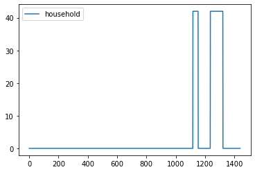

Simple Appliances with multiple functioning windows
===================================================

In this example we are going to build a load simulation of a households
category with only access to some indoor light bulbs.

.. code:: ipython3

    # importing functions
    from ramp import User, UseCase
    import pandas as pd

Creating a user category
~~~~~~~~~~~~~~~~~~~~~~~~

To represent a user category, which is a collection of users with
similar consumption characteristics such as appliance ownership and
consumption behavior, the class **User** should be used. Each User
instance is initially characterized by the number of users assigned to
the user category. For example, let’s consider a household category
comprising 10 households:

.. code:: ipython3

    household = User(
        user_name="Household",
        num_users=10,
    )

Creating a simple appliance with two functioning time
~~~~~~~~~~~~~~~~~~~~~~~~~~~~~~~~~~~~~~~~~~~~~~~~~~~~~

In the most basic use cases of RAMP, you can model appliances with
random usage variability across different time windows throughout the
day, as will be created in this example.

To model appliances within a household category, parameters such as the
number of appliances owned, power usage, number of usage windows, and
total usage time need to be specified. Additionally, parameters like the
minimum usage time after a switch-on event can enhance the realism of
simulations. The randomness of appliance usage can be adjusted through
parameters such as variability in the usage window or total usage time.

For example, let’s consider a household category where each household
owns 6 “Indoor Light Bulbs,” each consuming 7 Watts. These light bulbs
are used for 120 minutes in two time windows: from 00:00 to 00:30 and
from 19:30 to 24:00. In RAMP simulations, time resolution is measured in
minutes, with each simulation representing a single day from 00:00
(corresponding to minute 0) to 24:00 (corresponding to minute 1440).

Assuming a minimum usage time of 10 minutes each time a light bulb is
switched on, we can simulate this appliance by creating a new appliance
using the **add_appliance** method of the User object:

.. code:: ipython3

    # add_appliance is meth
    indoor_bulb = household.add_appliance(
        name="Indoor Light Bulb",  # the name of the appliance
        number=6,  # how many of this appliance each user has in this user category
        power=7,  # the power (in Watt) of each single appliance. RAMP does not deal with units of measures, you should check the consistency of the unit of measures throughout your model
        num_windows=2,  # how many usage time windows throughout the day?
        func_time=120,  # the total usage time of appliances
        func_cycle=10,  # the minimum usage time after a switch on event
        window_1=[0, 30],  # from 24 to 00:30
        window_2=[1170, 1440],  # from 19:30 to 24:00
        random_var_w=0.35,  # Variability of the windows in percentage
        time_fraction_random_variability=0.2,  # randomizes the total time the appliance is on (between 0 and 1)
    )

.. code:: ipython3

    print(household)

.. parsed-literal::

       user_name  num_users               name  number  power
    0  Household         10  Indoor Light Bulb       6    7.0

You can check the **maximum theoretical profile** of the appliance and
user category by calling the **maximum_profile** property of each user
or appliance object:

.. code:: ipython3

    # Checking the maximum profile of the appliance and user
    
    max_profile_bulb = pd.DataFrame(indoor_bulb.maximum_profile, columns=["appliance"])
    max_profile_user = pd.DataFrame(household.maximum_profile, columns=["household"])
    
    max_profile_bulb.plot()
    max_profile_user.plot()

.. parsed-literal::

    <Axes: >

.. image:: output_8_1.png

.. image:: output_8_2.png

Whole year profile functionality
~~~~~~~~~~~~~~~~~~~~~~~~~~~~~~~~

To generate profiles spanning more than a single day, the UseCase class
in RAMP allows for specifying calendar days as the start and end dates
of the simulation. The UseCase class serves as a collector of different
user categories and provides user-friendly methods for generating
profiles with various settings.

For example, suppose you want to simulate the behavior of 10 households
for the entire year 2020. Using the UseCase class, you can specify the
calendar days for the start and end dates of the simulation, creating a
comprehensive profile spanning the entire year:

.. code:: ipython3

    use_case = UseCase(
        users=[
            household
        ],  # A list of all the user categories to be included in the simulation. In this case, we only have household user category
        date_start="2020-01-01",  # starting date of the simulation
        date_end="2020-12-31",  # end date of the simulation
    )

.. parsed-literal::

    You will simulate 366 day(s) from 2020-01-01 00:00:00 until 2021-01-01 00:00:00

To generate the profiles, you can use, **generate_daily_load_profiles**
methods.

.. code:: ipython3

    whole_year_profile = use_case.generate_daily_load_profiles()

::

    ---------------------------------------------------------------------------

    NameError                                 Traceback (most recent call last)

    Cell In[16], line 1
    ----> 1 whole_year_profile = use_case.generate_daily_load_profiles()

    NameError: name 'use_case' is not defined

.. code:: ipython3

    whole_year_profile = pd.DataFrame(
        whole_year_profile, columns=["household"], index=use_case.datetimeindex
    )
    whole_year_profile.plot()

.. parsed-literal::

    <Axes: >

Generating a profile for a single day
~~~~~~~~~~~~~~~~~~~~~~~~~~~~~~~~~~~~~

To generate daily profiles for specific user categories, the User class
in RAMP offers various methods. One such method is
**generate_single_load_profile**, which constructs a load profile for a
single user, accounting for all their appliances, based on a specific
day of the year or a designated day_type. In RAMP, day_types represent
weekdays and weekends, with day_type=0 indicating weekdays and
day_type=1 signifying weekends. When defining appliances using the
add_appliance method, users can specify whether the appliance is
utilized throughout the designated wd_we_type argument.

For instance, let’s consider the scenario where we aim to generate a
single-day load profile for a weekday of the year for a single user
within the household category:

.. code:: ipython3

    single_profile = household.generate_single_load_profile(day_type=0)

.. parsed-literal::

    You are generating ramp demand from a User not bounded to a UseCase instance, a default one has been created for you 

.. code:: ipython3

    single_profile = pd.DataFrame(single_profile, columns=["household"])
    single_profile.plot()

.. parsed-literal::

    <Axes: >

.. image:: output_16_1.png

Generating aggregated_load_profile for the user category
~~~~~~~~~~~~~~~~~~~~~~~~~~~~~~~~~~~~~~~~~~~~~~~~~~~~~~~~

If instead of a single user from the categoy, you want to generate load
profiles of the aggregated users of the category, for a single day, you
can use the similar method of User class, named
**generate_aggregated_load_profile**:

.. code:: ipython3

    aggregated_profile = household.generate_aggregated_load_profile(day_type=0)

.. code:: ipython3

    aggregated_profile = pd.DataFrame(aggregated_profile, columns=["household"])
    aggregated_profile.plot()

.. parsed-literal::

    <Axes: >

.. image:: output_19_1.png

:download:`Link to the jupyter notebook file </../notebooks/simple_bulb.ipynb>`.
