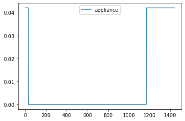
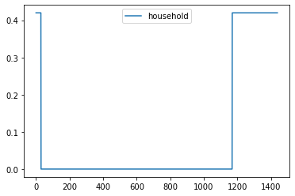
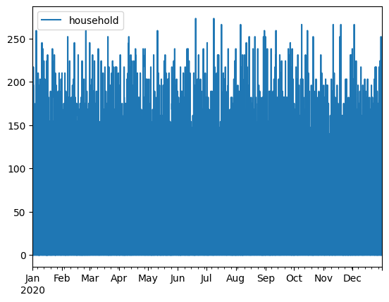
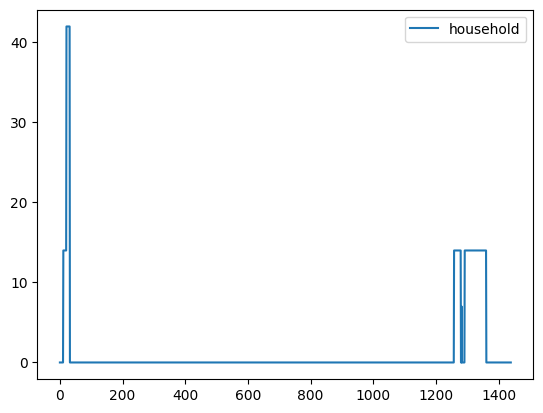
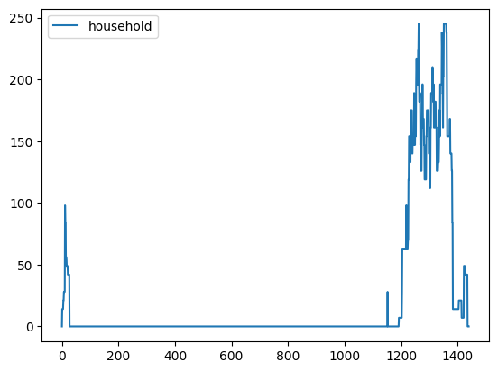

Simple Appliances with multiple functioning windows
===================================================

.. code:: ipython3

    # importing functions
    from ramp import User, UseCase, get_day_type
    import pandas as pd

Creating a user category
~~~~~~~~~~~~~~~~~~~~~~~~

.. code:: ipython3

    household = User(
        user_name="Household",
        num_users=10,
    )

Creating a simple appliance with two functioning time
~~~~~~~~~~~~~~~~~~~~~~~~~~~~~~~~~~~~~~~~~~~~~~~~~~~~~

.. code:: ipython3

    indoor_bulb = household.add_appliance(
        name="Indoor Light Bulb",
        number=6,
        power=7,
        num_windows=2,
        func_time=120,
        time_fraction_random_variability=0.2,
        func_cycle=10,
        window_1=[1170, 1440],  # from 19:30 to 24:00
        window_2=[0, 30],  # from 24 to 00:30
        random_var_w=0.35,
    )

.. code:: ipython3

    # Checking the maximum profile of the appliance and user
    
    max_profile_bulb = pd.DataFrame(indoor_bulb.maximum_profile, columns=["appliance"])
    max_profile_user = pd.DataFrame(household.maximum_profile, columns=["household"])
    
    max_profile_bulb.plot()
    max_profile_user.plot()

.. parsed-literal::

    <Axes: >

Whole year profile functionality
~~~~~~~~~~~~~~~~~~~~~~~~~~~~~~~~

.. code:: ipython3

    whole_year_profile = []
    use_case = UseCase(users=[household], date_start="2020-01-01", date_end="2020-12-31")
    whole_year_profile = use_case.generate_daily_load_profiles()

.. parsed-literal::

    You will simulate 366 day(s) from 2020-01-01 00:00:00 until 2021-01-01 00:00:00

.. code:: ipython3

    whole_year_profile = pd.DataFrame(
        whole_year_profile, columns=["household"], index=use_case.datetimeindex
    )
    whole_year_profile.plot()

.. parsed-literal::

    <Axes: >

Generating a profile for a single day
~~~~~~~~~~~~~~~~~~~~~~~~~~~~~~~~~~~~~

provide day_type=0 for weekday and day_type=1 for weekends

.. code:: ipython3

    single_profile = household.generate_single_load_profile(day_type=0)

.. code:: ipython3

    single_profile = pd.DataFrame(single_profile, columns=["household"])
    single_profile.plot()

.. parsed-literal::

    <Axes: >

Generating aggregated_load_profile for the user category
~~~~~~~~~~~~~~~~~~~~~~~~~~~~~~~~~~~~~~~~~~~~~~~~~~~~~~~~

Single daily profiles are aggregated for all the users defined within
the User class

.. code:: ipython3

    aggregated_profile = household.generate_aggregated_load_profile()

.. code:: ipython3

    aggregated_profile = pd.DataFrame(aggregated_profile, columns=["household"])
    aggregated_profile.plot()

.. parsed-literal::

    <Axes: >

