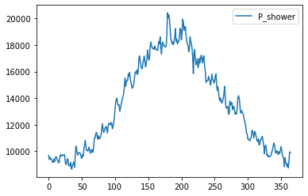
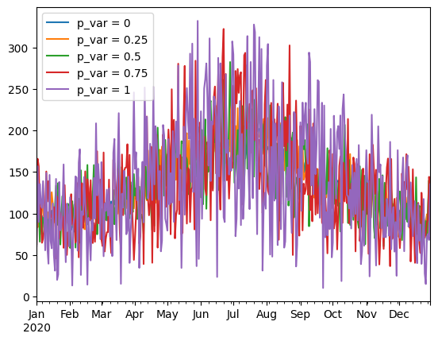
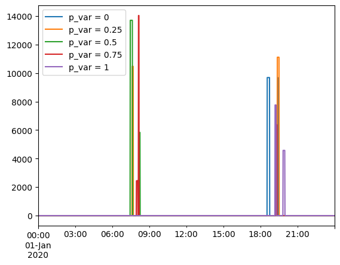

Thermal loads
=============

This example input file represents a single household user whose only
load is the “shower”. The example showcases how to model thermal loads
by: 1) using a time-varying average ``power`` attribute, pre-calculated
as a function of the average daily groundwater temperature; and 2) using
the ``thermal_p_var`` attribute to add further variability to the actual
power absorbed by the appliance in each usage event, which reflects the
randomness of user behaviour in preferring a slightly warmer or colder
shower temperature.

.. code:: ipython3

    # importing functions
    from ramp import User, UseCase, load_data, get_day_type
    import pandas as pd

Creating a user category and appliances
~~~~~~~~~~~~~~~~~~~~~~~~~~~~~~~~~~~~~~~

.. code:: ipython3

    household = User()

When the power varies across days of the year, for instance, as a
function of the average daily groundwater temperature, the “power”
parameter can be passed as a ``pd.DataFrame`` or ``np.array`` with a
daily profile (365 rows of data). For this exercise, data can be loaded
from the default examples in ramp:

.. code:: ipython3

    shower_power = load_data(example="shower")

.. code:: ipython3

    # shower power distribution
    shower_power.plot()

.. parsed-literal::

    <Axes: >

.. code:: ipython3

    shower = household.add_appliance(
        name="Shower",
        number=1,
        power=shower_power,
        num_windows=2,
        func_time=15,
        time_fraction_random_variability=0.1,
        func_cycle=3,
        window_1=[390, 540],
        window_2=[1080, 1200],
        random_var_w=0.2,
    )

Generating profiles for increasing degrees of ``thermal_p_var``
~~~~~~~~~~~~~~~~~~~~~~~~~~~~~~~~~~~~~~~~~~~~~~~~~~~~~~~~~~~~~~~

.. code:: ipython3

    usecase = UseCase(users=[household], date_start="2020-01-01")
    usecase.initialize(num_days=365)

.. parsed-literal::

    You will simulate 365 day(s) from 2020-01-01 00:00:00 until 2020-12-31 00:00:00

.. code:: ipython3

    def thermal_p_var_sensitivity(values):
        # buidling a pd.DataFrame for saving sensitivity results
        results = pd.DataFrame(
            index=pd.date_range(start="2020-01-01", periods=1440 * 365, freq="T"),
            columns=[f"p_var = {value}" for value in values],
        )
    
        for value in values:
            # changing the thermal_P_var
            shower.thermal_p_var = value
    
            profiles = usecase.generate_daily_load_profiles(flat=True)
    
            # assigning the yearly profile for a given sensitivity case
            results[f"p_var = {value}"] = profiles
    
        return results

.. code:: ipython3

    sensitivity_results = thermal_p_var_sensitivity([0, 0.25, 0.5, 0.75, 1])

.. code:: ipython3

    sensitivity_results

.. raw:: html

    

    
    <table border="1" class="dataframe">
      <thead>
        <tr style="text-align: right;">
          <th></th>
          <th>p_var = 0</th>
          <th>p_var = 0.25</th>
          <th>p_var = 0.5</th>
          <th>p_var = 0.75</th>
          <th>p_var = 1</th>
        </tr>
      </thead>
      <tbody>
        <tr>
          <th>2020-01-01 00:00:00</th>
          <td>0.0</td>
          <td>0.0</td>
          <td>0.0</td>
          <td>0.0</td>
          <td>0.0</td>
        </tr>
        <tr>
          <th>2020-01-01 00:01:00</th>
          <td>0.0</td>
          <td>0.0</td>
          <td>0.0</td>
          <td>0.0</td>
          <td>0.0</td>
        </tr>
        <tr>
          <th>2020-01-01 00:02:00</th>
          <td>0.0</td>
          <td>0.0</td>
          <td>0.0</td>
          <td>0.0</td>
          <td>0.0</td>
        </tr>
        <tr>
          <th>2020-01-01 00:03:00</th>
          <td>0.0</td>
          <td>0.0</td>
          <td>0.0</td>
          <td>0.0</td>
          <td>0.0</td>
        </tr>
        <tr>
          <th>2020-01-01 00:04:00</th>
          <td>0.0</td>
          <td>0.0</td>
          <td>0.0</td>
          <td>0.0</td>
          <td>0.0</td>
        </tr>
        <tr>
          <th>...</th>
          <td>...</td>
          <td>...</td>
          <td>...</td>
          <td>...</td>
          <td>...</td>
        </tr>
        <tr>
          <th>2020-12-30 23:55:00</th>
          <td>0.0</td>
          <td>0.0</td>
          <td>0.0</td>
          <td>0.0</td>
          <td>0.0</td>
        </tr>
        <tr>
          <th>2020-12-30 23:56:00</th>
          <td>0.0</td>
          <td>0.0</td>
          <td>0.0</td>
          <td>0.0</td>
          <td>0.0</td>
        </tr>
        <tr>
          <th>2020-12-30 23:57:00</th>
          <td>0.0</td>
          <td>0.0</td>
          <td>0.0</td>
          <td>0.0</td>
          <td>0.0</td>
        </tr>
        <tr>
          <th>2020-12-30 23:58:00</th>
          <td>0.0</td>
          <td>0.0</td>
          <td>0.0</td>
          <td>0.0</td>
          <td>0.0</td>
        </tr>
        <tr>
          <th>2020-12-30 23:59:00</th>
          <td>0.0</td>
          <td>0.0</td>
          <td>0.0</td>
          <td>0.0</td>
          <td>0.0</td>
        </tr>
      </tbody>
    </table>
    
525600 rows × 5 columns

    

.. code:: ipython3

    # showing the daily average of the load profiles
    average_daily_profiles = sensitivity_results.resample("1d").mean()

.. code:: ipython3

    average_daily_profiles.plot()

.. parsed-literal::

    <Axes: >

.. code:: ipython3

    first_day = pd.date_range(
        start="2020-01-01 00:00:00", freq="1min", periods=24 * 60  # a full day
    )
    sensitivity_results.loc[first_day].plot()

.. parsed-literal::

    <Axes: >

