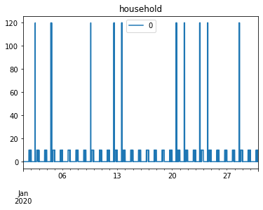

Using tabular inputs to build a model
============================

When the number of users or appliances is high, it can be difficult 
to create a model using python scripts. Therefore, RAMP allows you 
to create inputs in tabular format (.xlsx). In this example we show
a use case of this functionality.

.. code:: ipython3

    from ramp import User, Appliance, UseCase
    from ramp import calc_peak_time_range,yearly_pattern
    import pandas as pd

At the first step, user needs to creat User classes and assign
Appliances to the user class without assiging any detailed appliance
characteristics

Buidling a model database
~~~~~~~~~~~~~~~~~~~~~~~~~

.. code:: ipython3

    # Defining a dict of users with their appliances
    
    user_app = {
        "household" : ["light","tv"],
        "school": ["light","computer"]
    }

.. code:: ipython3

    # creating a UseCase class to create the database
    use_case = UseCase()

.. code:: ipython3

    # assinging the appliances to users
    for user,apps in user_app.items():
        
        user_instance = User(user_name = user)
        
        for app in apps:
            app_instance = user_instance.add_appliance(name=app)
            app_instance.windows()
            
        use_case.add_user(user_instance)

.. parsed-literal::

    UserWarning: No windows is declared, default window of 24 hours is selected
      warnings.warn(UserWarning("No windows is declared, default window of 24 hours is selected"))

Once the users and appliances are added to the :code:`use_case` instance, the
user can get a pd.DataFrame or an .xlsx file of all the data with the
default values.

Exporting the database
~~~~~~~~~~~~~~~~~~~~~~

.. code:: ipython3

    # getting the dataframe
    use_case.export_to_dataframe()

.. raw:: html

    

    
    <table border="1" class="dataframe">
      <thead>
        <tr style="text-align: right;">
          <th></th>
          <th>user_name</th>
          <th>num_users</th>
          <th>user_preference</th>
          <th>name</th>
          <th>number</th>
          <th>power</th>
          <th>num_windows</th>
          <th>func_time</th>
          <th>time_fraction_random_variability</th>
          <th>func_cycle</th>
          <th>...</th>
          <th>cw32_start</th>
          <th>cw32_end</th>
          <th>r_c3</th>
          <th>window_1_start</th>
          <th>window_1_end</th>
          <th>window_2_start</th>
          <th>window_2_end</th>
          <th>window_3_start</th>
          <th>window_3_end</th>
          <th>random_var_w</th>
        </tr>
      </thead>
      <tbody>
        <tr>
          <th>0</th>
          <td>household</td>
          <td>1</td>
          <td>0</td>
          <td>light</td>
          <td>1</td>
          <td>0.0</td>
          <td>1</td>
          <td>0</td>
          <td>0</td>
          <td>1</td>
          <td>...</td>
          <td>0</td>
          <td>0</td>
          <td>0</td>
          <td>0</td>
          <td>1440</td>
          <td>0</td>
          <td>0</td>
          <td>0</td>
          <td>0</td>
          <td>0</td>
        </tr>
        <tr>
          <th>1</th>
          <td>household</td>
          <td>1</td>
          <td>0</td>
          <td>tv</td>
          <td>1</td>
          <td>0.0</td>
          <td>1</td>
          <td>0</td>
          <td>0</td>
          <td>1</td>
          <td>...</td>
          <td>0</td>
          <td>0</td>
          <td>0</td>
          <td>0</td>
          <td>1440</td>
          <td>0</td>
          <td>0</td>
          <td>0</td>
          <td>0</td>
          <td>0</td>
        </tr>
        <tr>
          <th>2</th>
          <td>school</td>
          <td>1</td>
          <td>0</td>
          <td>light</td>
          <td>1</td>
          <td>0.0</td>
          <td>1</td>
          <td>0</td>
          <td>0</td>
          <td>1</td>
          <td>...</td>
          <td>0</td>
          <td>0</td>
          <td>0</td>
          <td>0</td>
          <td>1440</td>
          <td>0</td>
          <td>0</td>
          <td>0</td>
          <td>0</td>
          <td>0</td>
        </tr>
        <tr>
          <th>3</th>
          <td>school</td>
          <td>1</td>
          <td>0</td>
          <td>computer</td>
          <td>1</td>
          <td>0.0</td>
          <td>1</td>
          <td>0</td>
          <td>0</td>
          <td>1</td>
          <td>...</td>
          <td>0</td>
          <td>0</td>
          <td>0</td>
          <td>0</td>
          <td>1440</td>
          <td>0</td>
          <td>0</td>
          <td>0</td>
          <td>0</td>
          <td>0</td>
        </tr>
      </tbody>
    </table>
    
4 rows × 51 columns

    

.. code:: ipython3

    # Printing out the database to an .xlsx file
    use_case.save("path/name_of_file")

Once the function is used, an .xlsx file will be created in the given
path. Now you can easily fill-out the information in the .xlsx file and
load the data into the model database as detailed below.

Loading the database
~~~~~~~~~~~~~~~~~~~~

.. code:: ipython3

    # loading data
    
    use_case = UseCase() # creating a new UseCase instance
    use_case.load("path/name_of_file.xlsx")

Generating load profiles
~~~~~~~~~~~~~~~~~~~~~~~~

Once the database is loaded, the user can continue with the normal
analysis like generating aggregated profiles

.. code:: ipython3

    peak_time_range = calc_peak_time_range(
        user_list = use_case.users
    )
    
    year_behaviour = yearly_pattern()

.. code:: ipython3

    n_days = 30
    
    
    
    for user in use_case.users:
        user_profiles = []
        for day in range(n_days):
            profile = user.generate_aggregated_load_profile(
                            prof_i = day,
                            peak_time_range = peak_time_range,
                            Year_behaviour = year_behaviour
                        )
            
            user_profiles.extend(profile)
            
        profiles = pd.DataFrame(   
            data = user_profiles,
            index = pd.date_range(start = "2020-01-01",periods = 1440*n_days,freq="T"),
        )
        
        profiles.plot(title = user.user_name)
        
            

.. image:: output_17_1.png

